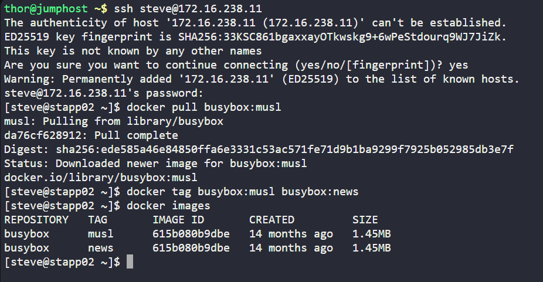

## Level 2

### Question 1:

Nautilus project developers are planning to start testing on a new project. As per their meeting with the DevOps team, they want to test containerized environment application features. As per details shared with DevOps team, we need to accomplish the following task:

a. Pull busybox:musl image on App Server 2 in Stratos DC and re-tag (create new tag) this image as busybox:news.

## Miscellaneous

